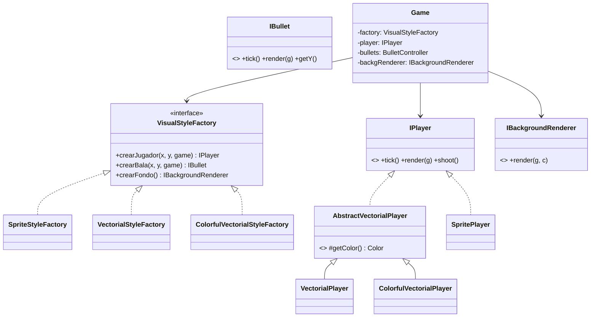

# Taller de Fábrica Abstracta — Spacewar 2D Refactoring

Esta es nuestra solución a la Parte II del taller de Diseño y Arquitectura de Software, sobre Inversión de Dependencias y Patrones Creacionales.
*Amy Nossa y Pablo Tamayo*


## El problema

El juego funcionaba, pero `Game`, `Player` y `Bullet` estaban totalmente pegados a los sprites: `Player` cargaba directamente un `BufferedImage` desde `sprites.png`, `BackgroundRenderer` dibujaba una imagen de fondo fija (`bg.png`), etc. No había forma de cambiar el estilo visual del juego sin meterse a reescribir el núcleo.

## Solución

La idea es separar "cómo se mueve/dispara/colisiona el jugador" de "cómo se ve dibujado en pantalla". Para eso:

- `IPlayer`, `IBullet` e `IBackgroundRenderer` son las abstracciones que el núcleo del juego (`Game`, `BulletController`, `InputHandler`) conoce y usa. En ningún archivo del núcleo aparece la palabra `Sprite` ni `Vectorial`.
- `VisualStyleFactory` es la fábrica abstracta: sabe crear un jugador, una bala y un fondo, todos del mismo estilo visual.
- Cada estilo visual tiene su propia fábrica concreta: `SpriteStyleFactory` (el original, con imágenes), `VectorialStyleFactory` (líneas y óvalos en blanco y negro) y `ColorfulVectorialStyleFactory` (lo mismo pero a color).
- `game.properties` tiene una sola línea (`visual.style.factory=...`) que le dice al juego, por reflexión, qué fábrica concreta cargar. Cambiar de estilo = cambiar esa línea.

Para que las dos variantes vectoriales no repitieran código (la física de movimiento, los límites del área de juego, la posición de las estrellas, etc. son iguales en ambas), esa lógica quedó en unas clases abstractas (`AbstractVectorialPlayer`, `AbstractVectorialBullet`, `AbstractVectorialBackgroundRenderer`) que las versiones concreta en blanco/negro y a color simplemente extienden, cambiando solo el color.



## Estructura de paquetes

```
com.balitechy.spacewar.main                    → núcleo del juego (Game, BulletController, InputHandler)
com.balitechy.spacewar.visual                   → interfaces + VisualStyleFactory + lector de configuración
com.balitechy.spacewar.visual.sprite            → estilo original (imágenes)
com.balitechy.spacewar.visual.vectorial         → vectorial-style (blanco y negro) + clases abstractas compartidas
com.balitechy.spacewar.visual.colorfulvectorial → colorful-vectorial-style (a color)
```

## Cómo correrlo

```
mvn clean install
mvn exec:java -Dexec.mainClass="com.balitechy.spacewar.main.Game"
```

Flechas para mover, espacio para disparar. Para cambiar el estilo visual, edita `visual.style.factory` en `src/main/resources/game.properties` con una de estas tres fábricas y vuelve a correr:

```
com.balitechy.spacewar.visual.sprite.SpriteStyleFactory
com.balitechy.spacewar.visual.vectorial.VectorialStyleFactory
com.balitechy.spacewar.visual.colorfulvectorial.ColorfulVectorialStyleFactory
```

## Evidencia de que corre

`vectorial-style` (líneas blancas sobre fondo negro):


`colorful-vectorial-style` — mismo juego, mismo `Game.java`, solo cambiamos la línea de configuración:


